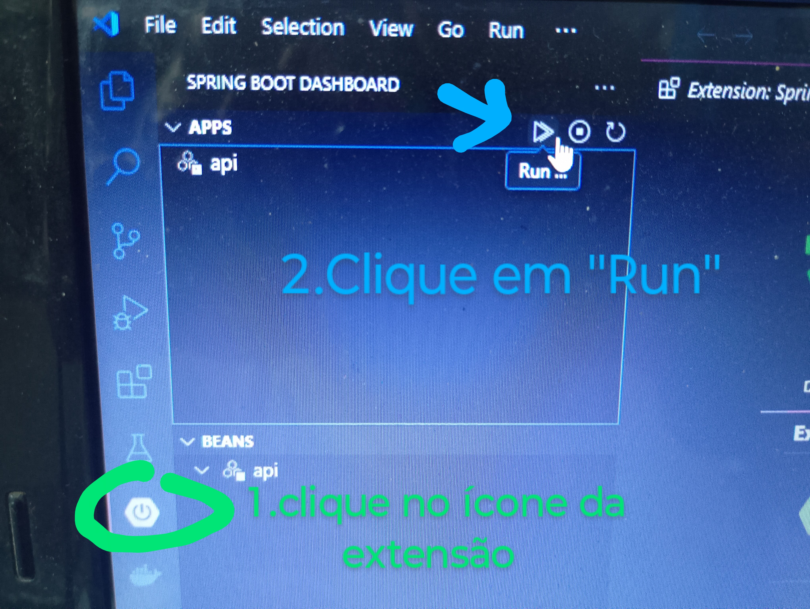

## API-G|F Natal
Dupla: Francisco David e Lívia

### *REQUISITOS:*
### A aplicação tem:
- abstração
- clean archtecture
- framework web
- injeção de depencia
- validação de dados
- crud das entidades
- rotas 

### O que faltou fazer:
- deploy
- autenticação/autorização
- aplicar método shuffle no sorteio

### como executar a aplicação 

- *Pré-requisitos*: jdk do java 21 ou superior instalado e banco de dados PostgreSQL instalado.

-*1.* Configurar as credenciais para conexão com banco de dados PostgreSQL.

*1.1*. no arquivo *aplicattion.propreties* na pasta  *src/main/resources/* definir o *host,porta e nome do banco* (na linha spring.datasource.url) , definir *nome do usuario* (na linha spring.datasource.username) , definir *senha do usuário* (na linha spring.datasource.password).

*2.* Para rodar a aplicação,pode-se utilizar uma extensão do vs code *Spring Boot Extesion Pack*

*2.1* para iniciar o app

*3. Rotas da Aplicação:*

-url base: localhost:8080

-endpoint */api/eventos* 

-enpoint  */api/sorteios* 

-endpoint */api/usuarios*

